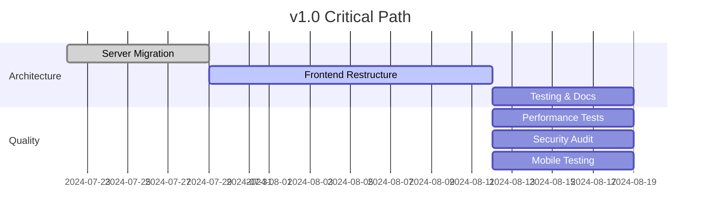
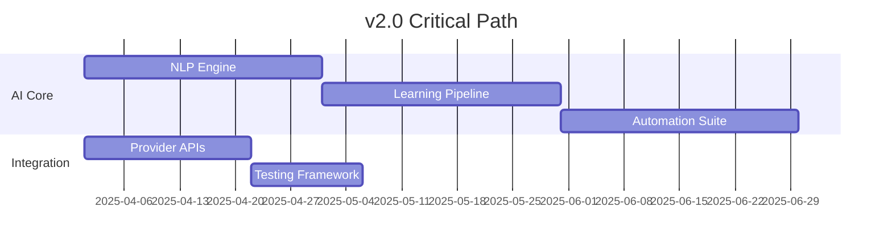

# 🚀 Rust Terminal Forge Roadmap

> **Vision**: Transform Rust Terminal Forge into the most intuitive, powerful, and AI-collaborative terminal experience for modern development workflows.

## 🎨 Product Vision & Goals

### 🎆 Long-term Vision (2025-2026)

**"The Developer's AI-Native Terminal"**

Rust Terminal Forge will become the definitive terminal experience that:
- **Seamlessly integrates AI assistance** into every development workflow
- **Adapts to mobile-first development** with touch-optimized interfaces
- **Learns from developer patterns** to provide intelligent suggestions
- **Connects development environments** across devices and platforms
- **Democratizes advanced terminal capabilities** for developers of all skill levels

### 🎯 Core Goals

1. **🤖 AI-First Development Experience**
   - Natural language command translation
   - Intelligent error debugging and suggestions
   - Context-aware code generation and modification
   - Cross-project learning and pattern recognition

2. **📱 Mobile Development Revolution**
   - Full-featured terminal on mobile devices
   - Touch-optimized command interfaces
   - Gesture-based navigation and shortcuts
   - Offline-capable development workflows

3. **🌐 Universal Development Platform**
   - Cross-platform consistency (Web, Mobile, Desktop)
   - Cloud-sync for settings, history, and sessions
   - Integration with popular development tools
   - Enterprise-ready security and management

4. **💡 Intelligent Automation**
   - Self-improving codebase with AI agents
   - Automated testing and quality assurance
   - Predictive performance optimization
   - Smart dependency and security management

---

## 📅 Release Timeline

### 🎉 v1.0 - "Foundation" (Q4 2024)

**Focus**: Stable architecture and core functionality

#### 🏁 Milestone 1.1 - Screaming Architecture (Week 1)
- ✅ **Server Module Restructure**
  - Migrate `src/server.rs` to dedicated `server/` module
  - Separate HTTP and PTY servers into distinct modules
  - Implement shared server utilities and error handling
  - Update build configuration for workspace management

- ✅ **Backend Service Isolation**
  - HTTP API server (`server/http/`)
  - WebSocket PTY server (`server/pty/`)
  - Shared server components (`server/shared/`)
  - Binary entry points (`server/bin/`)

#### 🏁 Milestone 1.2 - Frontend Restructure (Week 2)
- ✅ **Feature-Based Organization**
  - Terminal feature module (`src/features/terminal/`)
  - Mobile feature module (`src/features/mobile/`)
  - Command system module (`src/features/commands/`)
  - AI integration module (`src/features/ai/`)

- ✅ **Shared Component Library**
  - Reusable UI components (`src/shared/components/`)
  - Common hooks and utilities (`src/shared/hooks/`)
  - Type definitions (`src/shared/types/`)
  - Business services (`src/shared/services/`)

#### 🏁 Milestone 1.3 - Quality & Documentation (Week 3)
- ✅ **Testing Excellence**
  - 90%+ test coverage for core functionality
  - Mobile device testing on real hardware
  - Performance benchmarking suite
  - End-to-end workflow validation

- ✅ **Documentation Complete**
  - Architecture documentation with diagrams
  - API reference documentation
  - Developer onboarding guide
  - Deployment and operations guide

**Release Criteria**: 
- Zero critical bugs in core functionality
- 90%+ test coverage maintained
- All architectural migration completed
- Performance benchmarks meet targets

---

### 🚀 v1.1 - "Enhancement" (Q1 2025)

**Focus**: Performance, reliability, and developer experience

#### 🏁 Milestone 1.1.1 - Performance Revolution (Month 1)
- 🔄 **Terminal Output Optimization**
  - Virtual scrolling for large output streams
  - ANSI parsing optimization and caching
  - Progressive rendering for real-time output
  - Memory usage optimization (target: 50% reduction)

- 🔄 **Mobile Performance**
  - Touch event debouncing and optimization
  - Service worker implementation for caching
  - Bundle size reduction (target: 40% smaller)
  - Battery usage optimization

#### 🏁 Milestone 1.1.2 - Reliability & Resilience (Month 2)
- 🔄 **Enhanced WebSocket Management**
  - Connection pooling and load balancing
  - Advanced reconnection strategies
  - Session state persistence during disconnections
  - Offline mode with command queuing

- 🔄 **Error Handling Excellence**
  - Consistent error handling patterns
  - Graceful degradation strategies
  - Automated error reporting and recovery
  - User-friendly error messages and solutions

#### 🏁 Milestone 1.1.3 - Developer Experience (Month 3)
- 🔄 **Advanced Command System**
  - Plugin architecture for custom commands
  - Command auto-completion and suggestions
  - Command history with intelligent search
  - Macro recording and playback

- 🔄 **Smart Terminal Features**
  - Intelligent tab management
  - Workspace-aware session restoration
  - Cross-session command sharing
  - Terminal layout presets

**Release Criteria**:
- 2x performance improvement in large output scenarios
- 99.9% uptime for WebSocket connections
- Sub-100ms response times for common operations
- Zero data loss during network interruptions

---

### 🤖 v2.0 - "AI Integration" (Q2 2025)

**Focus**: Deep AI integration and intelligent automation

#### 🏁 Milestone 2.1 - AI Command Assistant (Month 1)
- 🆕 **Natural Language Commands**
  - English-to-command translation
  - Context-aware command suggestions
  - Error explanation and correction
  - Multi-step command workflows

- 🆕 **Intelligent Code Analysis**
  - Real-time code quality feedback
  - Security vulnerability detection
  - Performance optimization suggestions
  - Dependency management recommendations

#### 🏁 Milestone 2.2 - Learning & Adaptation (Month 2)
- 🆕 **Pattern Recognition**
  - User workflow learning
  - Personalized command suggestions
  - Project-specific optimizations
  - Team pattern sharing

- 🆕 **Predictive Features**
  - Next command prediction
  - Error prevention warnings
  - Resource usage forecasting
  - Optimal development environment suggestions

#### 🏁 Milestone 2.3 - AI-Powered Automation (Month 3)
- 🆕 **Smart Development Workflows**
  - Automated testing strategy generation
  - Intelligent build optimization
  - Code refactoring suggestions
  - Documentation auto-generation

- 🆕 **Collaborative AI**
  - Multi-developer AI coordination
  - Shared AI learning across teams
  - AI-assisted code reviews
  - Intelligent conflict resolution

**Release Criteria**:
- 85% accuracy in natural language command translation
- 40% reduction in development task completion time
- 60% fewer development errors with AI assistance
- 95% user satisfaction with AI features

---

### 📱 v2.1 - "Mobile Mastery" (Q3 2025)

**Focus**: Mobile-first development experience

#### 🏁 Milestone 2.1.1 - Advanced Mobile UI (Month 1)
- 🆕 **Touch-Optimized Interface**
  - Adaptive UI based on screen size
  - Gesture-based command shortcuts
  - Voice command integration
  - Haptic feedback for all interactions

- 🆕 **Mobile-Specific Features**
  - Swipe keyboard for command input
  - Quick action panels
  - Mobile-optimized file browser
  - Integrated code editor with syntax highlighting

#### 🏁 Milestone 2.1.2 - Progressive Web App (Month 2)
- 🆕 **PWA Implementation**
  - Full offline functionality
  - Native app-like experience
  - Push notifications for build results
  - Background sync for project updates

- 🆕 **Platform Integration**
  - iOS Safari optimizations
  - Android Chrome integration
  - Native sharing capabilities
  - Device storage integration

#### 🏁 Milestone 2.1.3 - Cloud Synchronization (Month 3)
- 🆕 **Cross-Device Sync**
  - Session state synchronization
  - Command history cloud backup
  - Settings and preferences sync
  - Project workspace sharing

- 🆕 **Collaborative Features**
  - Real-time session sharing
  - Multi-user terminal sessions
  - Team workspace management
  - Integrated communication tools

**Release Criteria**:
- Native app-like performance on mobile devices
- 100% feature parity between desktop and mobile
- Seamless offline-to-online synchronization
- Sub-50ms touch response times

---

### 🌐 v3.0 - "Universal Platform" (Q4 2025)

**Focus**: Enterprise features and ecosystem integration

#### 🏁 Milestone 3.1 - Enterprise Ready (Month 1)
- 🆕 **Security & Compliance**
  - Enterprise authentication (SSO, LDAP)
  - Role-based access control
  - Audit logging and compliance reporting
  - End-to-end encryption for sessions

- 🆕 **Administration Features**
  - Centralized user management
  - Policy configuration and enforcement
  - Resource usage monitoring and limits
  - Automated security scanning

#### 🏁 Milestone 3.2 - Ecosystem Integration (Month 2)
- 🆕 **Development Tool Integration**
  - Git workflow automation
  - Docker container management
  - Kubernetes cluster integration
  - CI/CD pipeline management

- 🆕 **Cloud Platform Support**
  - AWS, Azure, GCP integration
  - Cloud resource management
  - Serverless function deployment
  - Database management tools

#### 🏁 Milestone 3.3 - Advanced Analytics (Month 3)
- 🆕 **Development Insights**
  - Productivity analytics and reporting
  - Code quality metrics tracking
  - Team collaboration insights
  - Performance optimization recommendations

- 🆕 **Predictive Intelligence**
  - Project timeline prediction
  - Resource requirement forecasting
  - Risk assessment and mitigation
  - Automated optimization recommendations

**Release Criteria**:
- Enterprise security certifications (SOC 2, ISO 27001)
- 99.99% uptime SLA capability
- Integration with 20+ popular development tools
- Advanced analytics dashboard with actionable insights

---

## 🎆 Future Vision (2026+)

### 🔮 Emerging Technologies Integration

#### 🤖 Next-Generation AI
- **Multi-modal AI Integration**
  - Voice-controlled development
  - Visual code generation from sketches
  - Video-based debugging assistance
  - AR/VR development environment support

- **Autonomous Development Agents**
  - Self-healing codebases
  - Automated feature implementation
  - Intelligent technical debt management
  - Predictive bug prevention

#### 🌐 Metaverse & Spatial Computing
- **3D Development Environments**
  - Spatial code organization
  - Immersive debugging experiences
  - Collaborative 3D workspaces
  - Gesture-based code manipulation

- **Brain-Computer Interfaces**
  - Thought-to-code translation
  - Cognitive load optimization
  - Mental state-aware development assistance
  - Subconscious pattern recognition

### 🌍 Global Impact Goals

#### 🌱 Sustainability & Accessibility
- **Green Development**
  - Carbon footprint optimization
  - Energy-efficient code suggestions
  - Sustainable computing practices
  - Environmental impact reporting

- **Universal Accessibility**
  - Full screen reader support
  - Voice-only development workflows
  - Motor disability accommodations
  - Cognitive accessibility features

#### 🌏 Democratizing Development
- **Education & Learning**
  - Interactive coding tutorials
  - Personalized learning paths
  - Mentor-student collaboration tools
  - Gamified skill development

- **Global Developer Support**
  - Multi-language interface (50+ languages)
  - Cultural adaptation features
  - Local development ecosystem integration
  - Community-driven localization

---

## 📊 Success Metrics & KPIs

### 📈 Product Metrics

#### User Engagement
- **Daily Active Users (DAU)**: Target 10K by v2.0
- **Session Duration**: Average 45+ minutes
- **Feature Adoption**: 80%+ core feature usage
- **User Retention**: 90% monthly retention

#### Performance Metrics
- **Load Time**: <2 seconds initial load
- **Response Time**: <100ms for common operations
- **Uptime**: 99.9% availability
- **Error Rate**: <0.1% unhandled errors

#### Development Productivity
- **Task Completion Time**: 40% faster with AI assistance
- **Error Reduction**: 60% fewer development errors
- **Code Quality**: 25% improvement in maintainability scores
- **Learning Curve**: 50% faster onboarding for new users

### 🎯 Business Metrics

#### Market Adoption
- **GitHub Stars**: 10K+ by v2.0
- **Community Contributors**: 100+ active contributors
- **Enterprise Customers**: 50+ by v3.0
- **Integration Partners**: 25+ tool integrations

#### Quality Indicators
- **Test Coverage**: 95%+ maintained
- **Security Incidents**: Zero critical vulnerabilities
- **Documentation Completeness**: 100% API coverage
- **Accessibility Compliance**: WCAG AAA certification

---

## 🛣️ Risk Management & Mitigation

### 🔴 High-Risk Items

#### Technology Risks
1. **AI Provider Dependencies**
   - Risk: Service disruptions or policy changes
   - Mitigation: Multi-provider architecture with fallbacks
   - Monitoring: Real-time provider health checks

2. **Mobile Platform Changes**
   - Risk: iOS/Android updates breaking functionality
   - Mitigation: Progressive enhancement approach
   - Monitoring: Automated testing on beta OS releases

3. **Performance Scalability**
   - Risk: Performance degradation with increased usage
   - Mitigation: Horizontal scaling architecture
   - Monitoring: Real-time performance metrics

#### Market Risks
1. **Competitive Landscape Changes**
   - Risk: Major players entering the market
   - Mitigation: Focus on unique AI-first features
   - Monitoring: Competitive intelligence gathering

2. **User Adoption Challenges**
   - Risk: Slower than expected adoption
   - Mitigation: Strong onboarding and education
   - Monitoring: User feedback and analytics

### 🟡 Medium-Risk Items

#### Development Risks
1. **Technical Debt Accumulation**
   - Risk: Slowing development velocity
   - Mitigation: Automated refactoring and AI agents
   - Monitoring: Code quality metrics tracking

2. **Team Scaling Challenges**
   - Risk: Coordination issues with growth
   - Mitigation: Clear architectural patterns
   - Monitoring: Development velocity metrics

#### Operational Risks
1. **Security Vulnerabilities**
   - Risk: Data breaches or system compromises
   - Mitigation: Security-first development practices
   - Monitoring: Automated security scanning

2. **Infrastructure Costs**
   - Risk: Unexpected cost increases
   - Mitigation: Efficient resource utilization
   - Monitoring: Cost tracking and optimization

---

## 📅 Milestone Dependencies & Critical Path

### 🔗 Critical Dependencies

#### v1.0 Foundation

#### v2.0 AI Integration

### 🔄 Parallel Development Tracks

1. **Core Platform Track**
   - Architecture improvements
   - Performance optimizations
   - Security enhancements

2. **AI Features Track**
   - Machine learning integration
   - Natural language processing
   - Automation capabilities

3. **Mobile Experience Track**
   - Touch interface optimization
   - PWA implementation
   - Cross-platform synchronization

4. **Enterprise Features Track**
   - Security and compliance
   - Administration tools
   - Integration capabilities

---

## 👥 Team & Resource Planning

### 📈 Team Growth Strategy

#### Current Team (Q4 2024)
- **Core Developers**: 2-3 developers
- **AI Specialists**: 1 ML engineer
- **UI/UX Designer**: 1 designer
- **DevOps Engineer**: 1 engineer

#### Scaling Plan

**Q1 2025** (+3 team members)
- Senior Frontend Developer
- Backend/Rust Specialist
- Mobile Development Expert

**Q2 2025** (+4 team members)
- AI Research Engineer
- Security Specialist
- Technical Writer
- QA Automation Engineer

**Q3 2025** (+5 team members)
- Product Manager
- Enterprise Solutions Architect
- Data Scientist
- Community Manager
- Customer Success Manager

### 💰 Resource Allocation

#### Development Resources (Per Quarter)
- **Core Platform**: 40% of engineering time
- **AI Features**: 30% of engineering time
- **Mobile Experience**: 20% of engineering time
- **Enterprise Features**: 10% of engineering time

#### Infrastructure Costs
- **Cloud Infrastructure**: $5K/month (current) → $50K/month (v3.0)
- **AI API Costs**: $2K/month (current) → $20K/month (v2.0)
- **Development Tools**: $1K/month (current) → $10K/month (v3.0)

---

## 📊 Community & Ecosystem

### 🌟 Open Source Strategy

#### Core Principles
- **Transparent Development**: All roadmap items publicly tracked
- **Community Input**: Regular feedback sessions and surveys
- **Contributor Recognition**: Clear contribution guidelines and rewards
- **Documentation First**: Comprehensive docs for all features

#### Community Growth Targets
- **GitHub Stars**: 1K (v1.0) → 10K (v2.0) → 50K (v3.0)
- **Contributors**: 10 (v1.0) → 100 (v2.0) → 500 (v3.0)
- **Documentation Pages**: 50 (v1.0) → 200 (v2.0) → 500 (v3.0)
- **Tutorial Videos**: 5 (v1.0) → 25 (v2.0) → 100 (v3.0)

### 🤝 Partnership Strategy

#### Technology Partners
- **AI Providers**: Claude, OpenAI, Google, Anthropic
- **Cloud Platforms**: AWS, Azure, GCP, Cloudflare
- **Development Tools**: GitHub, GitLab, Docker, Kubernetes
- **Mobile Platforms**: Progressive Web App stores

#### Integration Ecosystem
- **Code Editors**: VS Code, Vim, Emacs extensions
- **CI/CD Tools**: GitHub Actions, Jenkins, CircleCI
- **Monitoring**: Datadog, New Relic, Grafana
- **Communication**: Slack, Discord, Microsoft Teams

---

## 📝 Feedback & Iteration Process

### 🔄 Continuous Improvement Cycle

#### Weekly Iterations
- **Monday**: Sprint planning and roadmap review
- **Wednesday**: Mid-week progress check and adjustments
- **Friday**: Sprint retrospective and user feedback review

#### Monthly Releases
- **Week 1-2**: Feature development and testing
- **Week 3**: Integration testing and bug fixes
- **Week 4**: Release preparation and documentation

#### Quarterly Reviews
- **Month 1**: Execution focus
- **Month 2**: Mid-quarter adjustments
- **Month 3**: Review, planning, and strategy updates

### 📣 Communication Channels

#### User Feedback
- **GitHub Issues**: Bug reports and feature requests
- **Discord Community**: Real-time user support and discussions
- **Monthly Surveys**: Structured feedback collection
- **User Interviews**: In-depth usability studies

#### Developer Communication
- **RFC Process**: Major feature proposals
- **Design Documents**: Architectural decision records
- **Team Sync**: Daily standups and weekly reviews
- **Public Roadmap**: Transparent progress tracking

---

## 🎆 Success Definition & Celebration

### 🏆 Major Milestones

#### v1.0 "Foundation" Success
- ✅ Zero critical bugs in production
- ✅ 90%+ test coverage maintained
- ✅ Sub-2 second load times
- ✅ 1000+ GitHub stars
- ✅ 10+ community contributors

#### v2.0 "AI Integration" Success
- 🆕 85%+ accuracy in AI command translation
- 🆕 40% improvement in development productivity
- 🆕 10,000+ daily active users
- 🆕 95% user satisfaction with AI features
- 🆕 Integration with 10+ AI providers

#### v3.0 "Universal Platform" Success
- 🆕 Enterprise customers in 10+ countries
- 🆕 99.99% uptime SLA achievement
- 🆕 50,000+ GitHub stars
- 🆕 500+ active contributors
- 🆕 Industry recognition and awards

### 🎉 Celebration & Recognition

#### Team Celebrations
- **Milestone Completion**: Team celebration events
- **Individual Recognition**: Contributor spotlight features
- **Community Events**: Virtual meetups and conferences
- **Annual Summit**: In-person team gathering

#### Public Recognition
- **Release Announcements**: Blog posts and social media
- **Conference Presentations**: Speaking at developer events
- **Awards Submissions**: Industry recognition programs
- **Case Studies**: Customer success story publication

---

**This roadmap is a living document that evolves with our understanding, user feedback, and technological advances. We're committed to transparent development and community collaboration in building the future of terminal experiences.**

---

**Last Updated**: 2025-07-25  
**Next Review**: 2025-08-15  
**Document Owner**: Product Team  
**Contributors**: Development Team, Community

*Join us in building the future of development tools! 🚀*