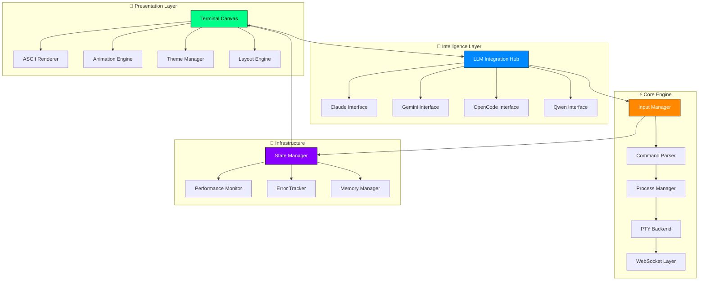
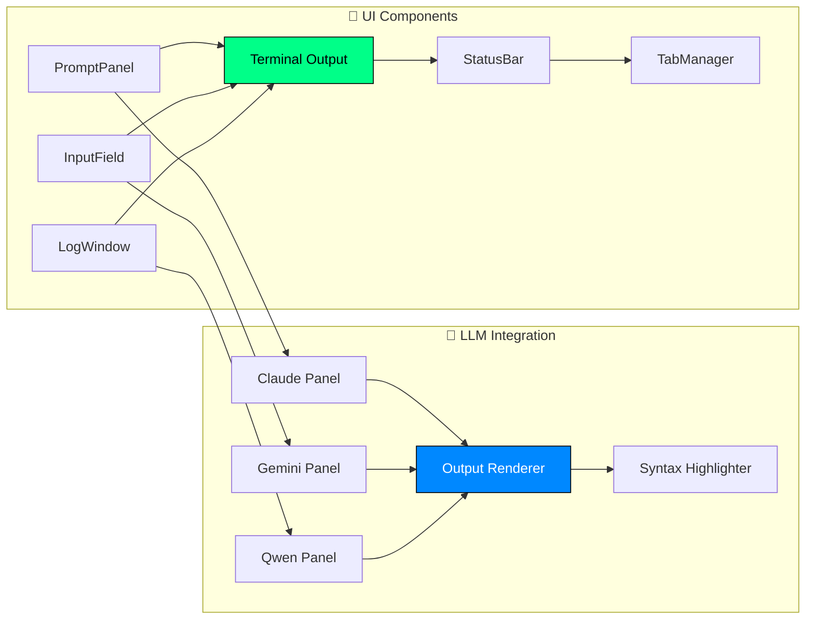

# 🧬 Rick's Interdimensional Terminal Architecture
*Scientific Terminal Design That Actually Makes Sense*

## 🔬 Mad Science Design Philosophy

Listen up, Morty! We're not building another boring terminal clone. This is a **scientifically superior** command interface that transcends the limitations of traditional terminals through quantum-level UI engineering.

### Core Principles
1. **Zero Chaos Architecture** - Every pixel has purpose, no overlapping nonsense
2. **Quantum Typography** - ASCII/Unicode rendering so crisp it breaks the fourth dimension
3. **Fluid Animation Physics** - Cursors that move like they understand spacetime
4. **Multi-LLM Symbiosis** - Claude, Gemini, OpenCode, Qwen integration without visual artifacts
5. **Performance Obsession** - Sub-millisecond rendering because time is money, Morty

## 🏗️ System Architecture Overview



## 🎯 Multi-Phase Execution Roadmap

### Phase 1: Foundation Architecture (Week 1-2)
**Objective**: Build the quantum foundation that eliminates chaos

#### Component Architecture
```typescript
// Core UI Components Hierarchy
interface TerminalArchitecture {
  canvas: {
    renderer: ASCIIRenderer;
    animator: FluidAnimator;
    layout: QuantumLayout;
  };
  intelligence: {
    llmHub: LLMIntegrationHub;
    providers: LLMProvider[];
  };
  engine: {
    input: PrecisionInputManager;
    process: ProcessOrchestrator;
    pty: RustPTYInterface;
  };
  infrastructure: {
    state: ReactiveStateManager;
    performance: MetricsCollector;
    monitoring: ErrorTracker;
  };
}
```

#### Critical Components to Build:

1. **QuantumLayout Engine** (`/src/engine/QuantumLayout.ts`)
   - Eliminates overlapping through mathematical precision
   - CSS Grid + Flexbox hybrid with collision detection
   - Viewport-aware responsive calculations

2. **FluidAnimator** (`/src/engine/FluidAnimator.ts`)
   - Physics-based cursor movements
   - Easing functions that feel natural
   - 60fps guaranteed animations

3. **ASCIIRenderer** (`/src/engine/ASCIIRenderer.ts`)
   - Pixel-perfect glyph rendering
   - Unicode fallback systems
   - Font metrics calculation

### Phase 2: Component Library (Week 3-4)
**Objective**: Build reusable components that don't suck



#### Component Specifications:

**PromptPanel Component**
```typescript
interface PromptPanelProps {
  prompt: string;
  cursor: CursorState;
  theme: TerminalTheme;
  animations: AnimationConfig;
  onInput: (input: string) => void;
  onKeyPress: (key: KeyEvent) => void;
}

// Features:
// - Sub-pixel cursor positioning
// - Autocomplete overlay
// - Syntax highlighting preview
// - Command history navigation
```

**InputField Component**
```typescript
interface InputFieldProps {
  value: string;
  placeholder: string;
  validator: InputValidator;
  renderer: ASCIIRenderer;
  onValidationChange: (isValid: boolean) => void;
}

// Features:
// - Real-time validation
// - Error highlighting
// - Auto-suggestion
// - Clipboard integration
```

**LogWindow Component**
```typescript
interface LogWindowProps {
  entries: LogEntry[];
  virtualScrolling: boolean;
  searchEnabled: boolean;
  filters: LogFilter[];
  maxEntries: number;
}

// Features:
// - Virtual scrolling for 100k+ entries
// - Search highlighting
// - Timestamp precision
// - Log level filtering
```

### Phase 3: LLM Integration Excellence (Week 5-6)
**Objective**: Make AI outputs render like they belong in the future

#### LLM Integration Hub
```typescript
class LLMIntegrationHub {
  private providers: Map<string, LLMProvider>;
  private renderer: OutputRenderer;
  private formatter: ResponseFormatter;
  
  async renderResponse(
    provider: string, 
    response: LLMResponse,
    format: OutputFormat
  ): Promise<RenderedOutput> {
    // Handles:
    // - Code syntax highlighting
    // - Markdown rendering
    // - Table formatting
    // - Image/diagram display
    // - Streaming output animation
  }
}
```

#### Output Rendering Specifications:
- **Code Blocks**: Syntax highlighting with 50+ languages
- **Tables**: Auto-sizing with overflow handling
- **Markdown**: Rich text with proper spacing
- **Streaming**: Character-by-character animation
- **Error States**: Clear visual error indication

### Phase 4: Testing & Quality Assurance (Week 7-8)
**Objective**: Bulletproof the entire system

#### Visual Diff Testing Strategy
```typescript
// Test Matrix
const testMatrix = {
  screens: ['320px', '768px', '1024px', '1440px', '4K'],
  dpi: ['1x', '1.5x', '2x', '3x'],
  fonts: ['JetBrains Mono', 'Fira Code', 'SF Mono'],
  themes: ['dark', 'light', 'neon', 'matrix'],
  content: ['ascii', 'unicode', 'mixed', 'emoji']
};

// Automated Visual Testing
describe('Terminal Rendering', () => {
  testMatrix.screens.forEach(screen => {
    testMatrix.dpi.forEach(dpi => {
      it(`renders perfectly at ${screen} @ ${dpi}`, async () => {
        await page.setViewport({ width: parseInt(screen), deviceScaleFactor: parseFloat(dpi) });
        const screenshot = await page.screenshot();
        expect(screenshot).toMatchImageSnapshot();
      });
    });
  });
});
```

### Phase 5: Performance & Monitoring (Week 9-10)
**Objective**: Make it fast enough to impress Rick

#### Performance Metrics
```typescript
interface PerformanceTargets {
  renderTime: '<16ms';      // 60fps guarantee
  inputLatency: '<10ms';    // Instantaneous feel
  memoryUsage: '<100MB';    // Efficient memory
  bundleSize: '<500KB';     // Fast loading
  startupTime: '<1s';       // Quick boot
}

// Real-time Performance Monitoring
class PerformanceMonitor {
  private metrics: MetricsCollector;
  
  trackRenderFrame(duration: number) {
    this.metrics.record('render_frame', duration);
    if (duration > 16) {
      this.reportSlowFrame(duration);
    }
  }
  
  trackInputLatency(timestamp: number) {
    const latency = performance.now() - timestamp;
    this.metrics.record('input_latency', latency);
  }
}
```

## 🎨 Visual Design System

### Typography Quantum Mechanics
```css
/* Scientific Typography Hierarchy */
:root {
  --font-terminal: 'JetBrains Mono', 'Fira Code', 'SF Mono', monospace;
  --font-ui: 'Inter', system-ui, sans-serif;
  
  /* Quantum Spacing Scale (Base-8 Physics) */
  --space-quantum: 8px;
  --space-1: calc(var(--space-quantum) * 1);  /* 8px */
  --space-2: calc(var(--space-quantum) * 2);  /* 16px */
  --space-3: calc(var(--space-quantum) * 3);  /* 24px */
  --space-4: calc(var(--space-quantum) * 4);  /* 32px */
  
  /* ASCII-Perfect Line Heights */
  --line-height-terminal: 1.2;
  --line-height-ui: 1.5;
}
```

### Color Science
```css
/* Rick's Scientific Color Palette */
:root {
  /* Portal Green (Primary) */
  --color-portal-green: #00ff88;
  --color-portal-green-glow: rgba(0, 255, 136, 0.3);
  
  /* Dimension Blue (Secondary) */
  --color-dimension-blue: #0088ff;
  --color-dimension-blue-glow: rgba(0, 136, 255, 0.3);
  
  /* Quantum Purple (Accent) */
  --color-quantum-purple: #8844ff;
  --color-quantum-purple-glow: rgba(136, 68, 255, 0.3);
  
  /* Science Yellow (Warning) */
  --color-science-yellow: #ffaa00;
  --color-science-yellow-glow: rgba(255, 170, 0, 0.3);
  
  /* Lab Red (Error) */
  --color-lab-red: #ff4444;
  --color-lab-red-glow: rgba(255, 68, 68, 0.3);
}
```

### Animation Physics
```css
/* Quantum Easing Functions */
:root {
  --ease-portal: cubic-bezier(0.25, 0.46, 0.45, 0.94);
  --ease-dimension: cubic-bezier(0.68, -0.55, 0.265, 1.55);
  --ease-quantum: cubic-bezier(0.175, 0.885, 0.32, 1.275);
}

/* Cursor Animation System */
@keyframes cursor-blink {
  0%, 50% { opacity: 1; }
  51%, 100% { opacity: 0; }
}

@keyframes cursor-move {
  from { transform: translateX(var(--from-x)); }
  to { transform: translateX(var(--to-x)); }
}

.terminal-cursor {
  animation: 
    cursor-blink 1s infinite step-end,
    cursor-move 0.15s var(--ease-portal);
}
```

## 🔧 Implementation Priority Matrix

### Critical Path (Must Fix First)
1. **Dual Cursor Elimination** - One cursor to rule them all
2. **Overlap Prevention** - Mathematical layout precision
3. **ASCII Alignment** - Pixel-perfect glyph positioning
4. **Performance Optimization** - Sub-16ms render times

### High Priority (Week 1-2)
1. **QuantumLayout Engine** - Foundation architecture
2. **FluidAnimator** - Smooth cursor movements
3. **ASCIIRenderer** - Perfect text rendering
4. **LLM Integration Hub** - Multi-provider support

### Medium Priority (Week 3-4)
1. **Component Library** - Reusable UI components
2. **Theme System** - Dynamic theming support
3. **Input Management** - Precise key handling
4. **Visual Testing** - Automated UI validation

### Future Enhancements (Week 5+)
1. **Plugin Architecture** - Extensible component system
2. **Custom Themes** - User theme creation
3. **Advanced Animations** - Physics-based transitions
4. **Performance Analytics** - Real-time metrics

## 🎯 Success Metrics

### User Experience KPIs
- **Input Responsiveness**: <10ms latency
- **Visual Smoothness**: 60fps animations
- **Zero Overlaps**: Mathematical layout precision
- **ASCII Perfection**: Pixel-aligned text rendering
- **Load Performance**: <1s startup time

### Technical Quality Gates
- **Zero Console Errors**: Clean browser logs
- **Type Safety**: 100% TypeScript coverage
- **Test Coverage**: >95% component testing
- **Bundle Efficiency**: <500KB gzipped
- **Memory Usage**: <100MB sustained

### Rick's Approval Criteria
- "Does it look like it came from the future?"
- "Can I type without wanting to shoot myself?"
- "Do the animations make me feel scientifically superior?"
- "Would I use this in my lab?"

---

*Wubba lubba dub dub! Now let's build the most scientifically advanced terminal interface in any dimension!*