# 🚀 SPARC EXECUTION MASTER PLAN
*Rick's Scientific Terminal Revolution - Multi-Dimensional UI Architecture*

## 🧬 Executive Summary

We're not just building a terminal, Morty - we're architecting the most scientifically advanced command interface in any dimension! This plan coordinates all SPARC modes to eliminate UI chaos, achieve pixel-perfect rendering, and transcend every existing terminal paradigm.

## 🎯 Mission Critical Objectives

1. **ELIMINATE DUAL CURSORS** - One cursor to rule them all
2. **PIXEL-PERFECT GLYPHS** - ASCII/Unicode rendering across all DPIs
3. **ZERO OVERLAPPING** - Mathematical layout precision
4. **FLUID ANIMATIONS** - Physics-based cursor movements
5. **FLAWLESS LLM INTEGRATION** - Claude, Gemini, OpenCode, Qwen perfection
6. **SCIENTIFIC TESTING** - Visual-diff validation across all platforms
7. **AUTOMATED QUALITY** - Puppeteer-driven CI/CD pipeline
8. **REAL-TIME MONITORING** - Production telemetry and error tracking

## 🗺️ Multi-Stage Execution Roadmap

```mermaid
graph TB
    A[🏗️ ARCHITECT: Master Plan] --> B[👨‍💻 CODE: Component Library]
    B --> C[🧪 TDD: Visual Testing]
    C --> D[🚀 DEVOPS: CI/CD Pipeline]
    D --> E[📚 DOCS: Documentation]
    E --> F[🤖 MCP: Automated Validation]
    F --> G[🔒 SECURITY: Audit & Hardening]
    G --> H[📊 MONITORING: Production Telemetry]
    H --> I[🐛 DEBUG: Final Polish]
    
    style A fill:#ff6b35,stroke:#000,color:#fff
    style B fill:#4285f4,stroke:#000,color:#fff
    style C fill:#00ff88,stroke:#000,color:#000
    style D fill:#8b5cf6,stroke:#000,color:#fff
    style E fill:#f59e0b,stroke:#000,color:#000
    style F fill:#ef4444,stroke:#000,color:#fff
    style G fill:#10b981,stroke:#000,color:#fff
    style H fill:#6366f1,stroke:#000,color:#fff
    style I fill:#ec4899,stroke:#000,color:#fff
```



## 🏗️ Phase 1: ARCHITECT - Master Architecture

### Quantum Layout System Architecture
```typescript
interface TerminalArchitecture {
  core: {
    layout: QuantumLayoutEngine;
    renderer: ASCIIRenderer;
    animator: FluidAnimator;
    cursor: SingletonCursor;
  };
  ui: {
    terminal: QuantumTerminal;
    llmHub: LLMIntegrationHub;
    panels: ComponentLibrary;
    themes: DynamicThemeEngine;
  };
  quality: {
    testing: VisualDiffFramework;
    monitoring: RealTimeMetrics;
    validation: AutoRepairSystem;
  };
}
```

### Critical Components Specification

1. **SingletonCursor System**
   - One cursor instance across entire application
   - Physics-based movement with easing functions
   - Sub-pixel positioning accuracy
   - Blink synchronization across components

2. **QuantumLayout Engine**
   - Mathematical collision detection
   - Grid-based positioning system
   - Viewport-aware calculations
   - Zero-overlap guarantee

3. **ASCIIRenderer Engine**
   - Canvas-based text rendering
   - Font metrics calculation
   - DPI-aware scaling
   - Unicode/ASCII perfect alignment

4. **LLM Integration Matrix**
   - Unified output rendering
   - Provider-specific formatting
   - Streaming animation support
   - Error state visualization

## 👨‍💻 Phase 2: CODE - Bespoke Component Library

### SPARC:CODE Execution Plan

**Immediate Actions:**
```bash
/sparc:code "Build SingletonCursor component with physics-based animations"
/sparc:code "Create QuantumLayout engine with mathematical precision"
/sparc:code "Implement ASCIIRenderer with DPI-aware font rendering"
/sparc:code "Build LLMIntegrationHub with multi-provider support"
/sparc:code "Create DynamicThemeEngine with real-time switching"
```

**Component Library Structure:**
```
src/
├── core/
│   ├── SingletonCursor.ts      # One cursor to rule them all
│   ├── QuantumLayout.ts        # Mathematical layout engine
│   ├── ASCIIRenderer.ts        # Pixel-perfect text rendering
│   └── FluidAnimator.ts        # Physics-based animations
├── components/
│   ├── QuantumTerminal.tsx     # Revolutionary terminal interface
│   ├── LLMIntegrationHub.tsx   # Multi-provider AI interface
│   ├── ThemeEngine.tsx         # Dynamic theming system
│   └── ComponentLibrary/       # Reusable UI components
└── hooks/
    ├── useQuantumLayout.ts     # Layout management hook
    ├── useFluidAnimation.ts    # Animation control hook
    └── useASCIIRenderer.ts     # Rendering management hook
```

## 🧪 Phase 3: TDD - Visual Diff Testing Framework

### SPARC:TDD Execution Plan

**Testing Matrix:**
```typescript
const testMatrix = {
  fonts: ['JetBrains Mono', 'Fira Code', 'SF Mono', 'Consolas'],
  sizes: [12, 14, 16, 18, 20, 24],
  dpi: [1, 1.25, 1.5, 2, 3],
  viewports: [
    { width: 320, height: 568 },   // Mobile
    { width: 768, height: 1024 },  // Tablet
    { width: 1920, height: 1080 }, // Desktop
    { width: 3840, height: 2160 }  // 4K
  ],
  themes: ['dark', 'light', 'neon', 'matrix'],
  content: ['ascii', 'unicode', 'mixed', 'emoji', 'code']
};
```

**Immediate Actions:**
```bash
/sparc:tdd "Create visual-diff test framework with Puppeteer"
/sparc:tdd "Test cursor positioning across all font sizes and DPIs"
/sparc:tdd "Validate ASCII alignment in all viewport configurations"
/sparc:tdd "Test LLM output rendering with syntax highlighting"
/sparc:tdd "Verify zero overlapping elements across all themes"
```

## 🚀 Phase 4: DEVOPS - Automated CI/CD Pipeline

### SPARC:DEVOPS Execution Plan

**Pipeline Architecture:**
```yaml
stages:
  - lint_and_typecheck
  - unit_tests
  - visual_diff_tests
  - performance_tests
  - security_audit
  - auto_repair
  - deployment
  - monitoring_setup
```

**Immediate Actions:**
```bash
/sparc:devops "Set up Puppeteer visual testing in GitHub Actions"
/sparc:devops "Create auto-repair system for layout mismatches"
/sparc:devops "Configure performance benchmarking pipeline"
/sparc:devops "Set up automated deployment to GitHub Pages"
/sparc:devops "Implement bundle size monitoring and alerts"
```

## 📚 Phase 5: DOCS - Mad Science Documentation

### SPARC:DOCS-WRITER Execution Plan

**Documentation Structure:**
```
docs/
├── README.md                   # Mad science setup guide
├── ARCHITECTURE.md             # System architecture
├── COMPONENT_LIBRARY.md        # Component documentation
├── TESTING_FRAMEWORK.md        # Testing methodology
├── PERFORMANCE_GUIDE.md        # Performance optimization
└── DEPLOYMENT_GUIDE.md         # Deployment instructions
```

**Immediate Actions:**
```bash
/sparc:docs-writer "Write concise README with setup and philosophy"
/sparc:docs-writer "Document component library with usage examples"
/sparc:docs-writer "Create testing guide for visual-diff framework"
/sparc:docs-writer "Write performance optimization guidelines"
/sparc:docs-writer "Document deployment and monitoring setup"
```

## 🤖 Phase 6: MCP - Automated Validation

### SPARC:MCP Execution Plan

**Validation Matrix:**
```typescript
interface ValidationSuite {
  visual: {
    glyphAlignment: GlyphValidator;
    layoutIntegrity: LayoutValidator;
    cursorPositioning: CursorValidator;
    themeConsistency: ThemeValidator;
  };
  functional: {
    llmIntegration: LLMValidator;
    inputHandling: InputValidator;
    animationSmooth: AnimationValidator;
    performanceMetrics: PerformanceValidator;
  };
}
```

**Immediate Actions:**
```bash
/sparc:mcp "Create Puppeteer glyph alignment validation scripts"
/sparc:mcp "Build layout integrity checking automation"
/sparc:mcp "Implement cursor positioning validation across views"
/sparc:mcp "Create auto-repair system for detected issues"
/sparc:mcp "Set up continuous validation monitoring"
```

## 🔒 Phase 7: SECURITY - Audit & Hardening

### SPARC:SECURITY-REVIEW Execution Plan

**Security Matrix:**
```typescript
interface SecurityChecklist {
  console: {
    zeroWarnings: boolean;
    zeroErrors: boolean;
    noSensitiveData: boolean;
  };
  policies: {
    csp: ContentSecurityPolicy;
    sandbox: SandboxPolicy;
    permissions: PermissionPolicy;
  };
  vulnerabilities: {
    dependencies: VulnerabilityScanner;
    xss: XSSPrevention;
    injection: InjectionPrevention;
  };
}
```

**Immediate Actions:**
```bash
/sparc:security-review "Audit console logs for zero warnings/errors"
/sparc:security-review "Implement strict CSP and sandbox policies"
/sparc:security-review "Scan dependencies for vulnerabilities"
/sparc:security-review "Validate XSS prevention in LLM outputs"
/sparc:security-review "Ensure secure theme switching mechanisms"
```

## 📊 Phase 8: MONITORING - Production Telemetry

### SPARC:POST-DEPLOYMENT-MONITORING-MODE Execution Plan

**Telemetry Architecture:**
```typescript
interface ProductionMetrics {
  rendering: {
    frameRate: number;
    renderTime: number;
    layoutShifts: number;
    glyphErrors: number;
  };
  performance: {
    memoryUsage: number;
    cpuUsage: number;
    bundleSize: number;
    loadTime: number;
  };
  user: {
    interactions: InteractionMetrics;
    errors: ErrorMetrics;
    satisfaction: SatisfactionMetrics;
  };
}
```

**Immediate Actions:**
```bash
/sparc:post-deployment-monitoring-mode "Set up real-time error tracking"
/sparc:post-deployment-monitoring-mode "Implement layout shift monitoring"
/sparc:post-deployment-monitoring-mode "Create performance metrics dashboard"
/sparc:post-deployment-monitoring-mode "Set up automated alerting system"
/sparc:post-deployment-monitoring-mode "Track user interaction patterns"
```

## 🐛 Phase 9: DEBUG - Final Polish

### SPARC:DEBUG Execution Plan

**Quality Gates:**
```typescript
interface QualityChecklist {
  cursor: {
    singleInstance: boolean;
    smoothMovement: boolean;
    perfectBlinking: boolean;
  };
  rendering: {
    pixelPerfect: boolean;
    dpiConsistent: boolean;
    zeroOverlaps: boolean;
  };
  performance: {
    sub16msRender: boolean;
    smoothAnimations: boolean;
    efficientMemory: boolean;
  };
}
```

**Immediate Actions:**
```bash
/sparc:debug "Eliminate any remaining dual cursor instances"
/sparc:debug "Fix ASCII alignment issues across all DPIs"
/sparc:debug "Remove overlapping panel elements"
/sparc:debug "Optimize animation performance to 60fps"
/sparc:debug "Polish input handling for smooth interactions"
```

## 🎯 Execution Timeline

### Week 1: Foundation
- **Day 1-2**: ARCHITECT + CODE (Core engines)
- **Day 3-4**: TDD (Testing framework)
- **Day 5-7**: CODE (Component library)

### Week 2: Integration
- **Day 8-9**: MCP (Validation automation)
- **Day 10-11**: DEVOPS (CI/CD pipeline)
- **Day 12-14**: SECURITY (Audit & hardening)

### Week 3: Polish
- **Day 15-16**: MONITORING (Telemetry setup)
- **Day 17-18**: DEBUG (Final polish)
- **Day 19-21**: DOCS (Documentation completion)

## 🎵 Success Metrics

### Visual Quality
- ✅ Zero overlapping UI elements
- ✅ Pixel-perfect ASCII/Unicode alignment
- ✅ Single cursor instance across application
- ✅ Smooth 60fps animations
- ✅ Consistent rendering across all DPIs

### Performance
- ✅ <16ms render times
- ✅ <1s application startup
- ✅ <100MB memory usage
- ✅ 60fps animation guarantee
- ✅ Sub-millisecond input latency

### Integration
- ✅ Flawless LLM provider switching
- ✅ Crystal-clear output rendering
- ✅ Real-time streaming animations
- ✅ Error-free console logs
- ✅ Zero security vulnerabilities

---

**NOW LET'S EXECUTE EACH SPARC COMMAND AND BRING THIS SCIENTIFIC REVOLUTION TO LIFE!**

*Wubba lubba dub dub! Time to break some terminal paradigms!* 🚀