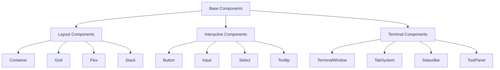
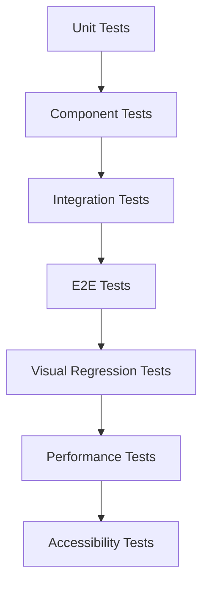

# Terminal UI Redesign Architecture Plan

## 🎯 Project Overview

Transform the current terminal UI into a professional, industry-grade interface that exceeds standards set by NvChad, GitHub Codespaces, VS Code terminals, and GitBash.

## 🏗️ Architecture Components

```mermaid
graph TB
    subgraph "UI Architecture"
        A[Design System] --> B[Component Library]
        B --> C[Layout Engine]
        C --> D[Theme Engine]
        D --> E[Responsive System]
    end
    
    subgraph "SPARC Integration"
        F[/sparc:tdd] --> G[Test-Driven UI Development]
        H[/sparc:code] --> I[Implementation]
        J[/sparc:security-review] --> K[Security Validation]
        L[/sparc:devops] --> M[Build & Deploy]
        N[/sparc:debug] --> O[Quality Assurance]
        P[/sparc:docs-writer] --> Q[Documentation]
        R[/sparc:mcp] --> S[Integration Testing]
        T[/sparc:post-deployment-monitoring] --> U[Performance Monitoring]
    end
    
    subgraph "Quality Gates"
        V[Visual Regression Tests]
        W[Performance Benchmarks]
        X[Accessibility Compliance]
        Y[Security Audit]
        Z[Cross-Platform Testing]
    end
    
    A --> G
    I --> V
    K --> Y
    M --> W
    O --> X
    S --> Z
```

## 📋 Detailed Implementation Plan

### Phase 1: Foundation Architecture

#### 1.1 Design System Foundation (`/sparc:architect` + `/sparc:code`)

**Deliverable**: Professional design tokens and component architecture

```typescript
// Design System Tokens
interface DesignTokens {
  colors: {
    primary: { 50: string; 100: string; ... 900: string; };
    neutral: { 50: string; 100: string; ... 900: string; };
    semantic: {
      success: string;
      warning: string;
      error: string;
      info: string;
    };
  };
  typography: {
    fontFamilies: {
      mono: string;
      sans: string;
    };
    fontSizes: { xs: string; sm: string; ... 6xl: string; };
    lineHeights: { tight: number; normal: number; relaxed: number; };
  };
  spacing: { 0: string; 0.5: string; ... 96: string; };
  shadows: { sm: string; md: string; lg: string; xl: string; };
  borderRadius: { none: string; sm: string; ... full: string; };
}
```

**Components to Create**:
- `DesignSystemProvider`
- `ThemeProvider` 
- `ColorPalette`
- `TypographyScale`
- `SpacingSystem`

#### 1.2 Component Library (`/sparc:code` + `/sparc:tdd`)

**Deliverable**: Professional, reusable UI components



### Phase 2: Visual Excellence

#### 2.1 Professional Theme System (`/sparc:code` + `/sparc:tdd`)

**Requirements**:
- Zero emoji usage (text-only icons)
- Professional color schemes inspired by industry leaders
- Smooth transitions and micro-interactions
- High contrast accessibility compliance

**Theme Specifications**:

```typescript
interface ProfessionalTheme {
  name: string;
  colors: {
    // Base colors (industry-standard)
    background: {
      primary: string;      // #1e1e1e (VS Code dark)
      secondary: string;    // #252526 (VS Code sidebar)
      tertiary: string;     // #2d2d30 (VS Code panel)
    };
    foreground: {
      primary: string;      // #cccccc (primary text)
      secondary: string;    // #969696 (secondary text)
      muted: string;        // #6a6a6a (muted text)
    };
    accent: {
      primary: string;      // #007acc (VS Code blue)
      hover: string;        // #1177bb (hover state)
      active: string;       // #0e639c (active state)
    };
    semantic: {
      success: string;      // #28a745 (GitHub green)
      warning: string;      // #ffc107 (Bootstrap warning)
      error: string;        // #dc3545 (GitHub red)
      info: string;         // #17a2b8 (Bootstrap info)
    };
  };
  typography: ProfessionalTypography;
  shadows: ProfessionalShadows;
  borders: ProfessionalBorders;
}
```

#### 2.2 Layout Engine (`/sparc:code` + `/sparc:tdd`)

**Responsive Breakpoints**:
```scss
$breakpoints: (
  sm: 640px,   // Mobile large
  md: 768px,   // Tablet
  lg: 1024px,  // Desktop small
  xl: 1280px,  // Desktop large
  2xl: 1536px  // Desktop extra large
);
```

**Layout System**:
- CSS Grid for complex layouts
- Flexbox for component-level layouts
- Container queries for responsive components
- Viewport units for fluid typography

### Phase 3: Component Implementation

#### 3.1 Terminal Window Component (`/sparc:code` + `/sparc:tdd`)

**Professional Terminal Features**:
```typescript
interface TerminalWindowProps {
  variant: 'primary' | 'secondary';
  size: 'sm' | 'md' | 'lg' | 'xl';
  title?: string;
  subtitle?: string;
  actions?: TerminalAction[];
  tabs?: TerminalTab[];
  statusBar?: boolean;
  resizable?: boolean;
  minimizable?: boolean;
  maximizable?: boolean;
}
```

**Visual Specifications**:
- Clean, minimal chrome (inspired by VS Code terminal)
- Proper visual hierarchy
- Consistent spacing (8px base unit)
- Professional button styling
- No overlapping elements
- Proper focus management

#### 3.2 Tab System (`/sparc:code` + `/sparc:tdd`)

**Professional Tab Features**:
```typescript
interface TabSystemProps {
  tabs: ProfessionalTab[];
  activeTab: string;
  onTabChange: (tabId: string) => void;
  onTabClose?: (tabId: string) => void;
  onTabAdd?: () => void;
  maxTabs?: number;
  sortable?: boolean;
}

interface ProfessionalTab {
  id: string;
  title: string;
  icon?: string; // Text-only icons (e.g., "⚡", "●", "□")
  status?: 'active' | 'inactive' | 'modified' | 'error';
  closable?: boolean;
  pinned?: boolean;
}
```

#### 3.3 Tool Integration Panels (`/sparc:code` + `/sparc:tdd`)

**AI Tool Integration**:
```typescript
interface ToolPanelProps {
  tool: 'claude' | 'qwen' | 'gemini' | 'vim' | 'code';
  variant: 'embedded' | 'overlay' | 'sidebar';
  theme: ProfessionalTheme;
  onClose?: () => void;
  onMinimize?: () => void;
  onMaximize?: () => void;
}
```

### Phase 4: Quality Assurance

#### 4.1 Testing Strategy (`/sparc:tdd` + `/sparc:mcp`)

**Test Pyramid**:


**Test Categories**:

1. **Unit Tests** (Vitest)
   - Component rendering
   - Props validation
   - Event handling
   - Theme application

2. **Visual Regression Tests** (Puppeteer + Chromatic)
   - Component screenshots
   - Layout consistency
   - Theme switching
   - Responsive behavior

3. **Performance Tests** (Lighthouse CI)
   - Bundle size analysis
   - Runtime performance
   - Memory usage
   - Animation smoothness

4. **Accessibility Tests** (axe-core)
   - WCAG 2.1 AA compliance
   - Keyboard navigation
   - Screen reader compatibility
   - Color contrast validation

#### 4.2 Security Review (`/sparc:security-review`)

**Security Checklist**:
- [ ] No XSS vulnerabilities in dynamic content
- [ ] No console errors that expose sensitive information
- [ ] Proper Content Security Policy headers
- [ ] Safe handling of user input
- [ ] No hardcoded secrets or credentials
- [ ] Secure theme switching (no code injection)

### Phase 5: Cross-Platform Excellence

#### 5.1 Responsive Design (`/sparc:code` + `/sparc:tdd`)

**Breakpoint Strategy**:
```typescript
interface ResponsiveConfig {
  mobile: {
    maxWidth: 767;
    layout: 'single-column';
    navigation: 'bottom-tabs';
    density: 'comfortable';
  };
  tablet: {
    minWidth: 768;
    maxWidth: 1023;
    layout: 'sidebar-main';
    navigation: 'side-tabs';
    density: 'normal';
  };
  desktop: {
    minWidth: 1024;
    layout: 'multi-panel';
    navigation: 'top-tabs';
    density: 'compact';
  };
}
```

#### 5.2 Performance Optimization (`/sparc:devops` + `/sparc:post-deployment-monitoring`)

**Performance Targets**:
- First Contentful Paint: < 1.5s
- Largest Contentful Paint: < 2.5s
- Cumulative Layout Shift: < 0.1
- First Input Delay: < 100ms
- Bundle size: < 250KB gzipped

**Optimization Strategies**:
- Code splitting by route and feature
- Lazy loading of heavy components
- Image optimization and WebP usage
- CSS-in-JS optimization
- Service worker for caching

## 🎨 Visual Design Specifications

### Color Palette (NvChad/VS Code Inspired)

```typescript
const professionalColors = {
  // Dark theme (primary)
  dark: {
    background: {
      primary: '#1e1e1e',    // Main background
      secondary: '#252526',   // Sidebar background
      tertiary: '#2d2d30',    // Panel background
      elevated: '#3c3c3c',    // Modal/tooltip background
    },
    foreground: {
      primary: '#cccccc',     // Primary text
      secondary: '#9da5b4',   // Secondary text
      muted: '#6a6a6a',       // Muted text
      inverse: '#1e1e1e',     // Inverse text
    },
    accent: {
      primary: '#007acc',     // Primary accent (links, buttons)
      secondary: '#0e70aa',   // Secondary accent
      success: '#28a745',     // Success state
      warning: '#ffc107',     // Warning state
      error: '#f14c4c',       // Error state
      info: '#17a2b8',        // Info state
    },
    border: {
      default: '#3c3c3c',     // Default border
      muted: '#2d2d30',       // Subtle border
      strong: '#6a6a6a',      // Strong border
    }
  }
};
```

### Typography System

```typescript
const typography = {
  fontFamilies: {
    mono: '"JetBrains Mono", "Fira Code", "SF Mono", Monaco, Consolas, monospace',
    sans: '"Inter", -apple-system, BlinkMacSystemFont, "Segoe UI", Roboto, sans-serif',
  },
  fontSizes: {
    xs: '0.75rem',    // 12px
    sm: '0.875rem',   // 14px
    base: '1rem',     // 16px
    lg: '1.125rem',   // 18px
    xl: '1.25rem',    // 20px
    '2xl': '1.5rem',  // 24px
  },
  fontWeights: {
    normal: 400,
    medium: 500,
    semibold: 600,
    bold: 700,
  },
  lineHeights: {
    tight: 1.25,
    normal: 1.5,
    relaxed: 1.75,
  }
};
```

## 🚀 SPARC Mode Coordination

### Phase Execution Plan

#### Phase 1: Foundation (Days 1-2)
1. **`/sparc:architect`**: Finalize component architecture
2. **`/sparc:tdd`**: Write comprehensive UI tests
3. **`/sparc:code`**: Implement design system foundation
4. **`/sparc:security-review`**: Review design system security

#### Phase 2: Core Components (Days 3-4)
1. **`/sparc:tdd`**: Write component-specific tests
2. **`/sparc:code`**: Implement core UI components
3. **`/sparc:mcp`**: Set up integration testing
4. **`/sparc:debug`**: Component debugging and optimization

#### Phase 3: Integration (Days 5-6)
1. **`/sparc:code`**: Integrate components into layouts
2. **`/sparc:tdd`**: Integration testing
3. **`/sparc:mcp`**: End-to-end testing with Puppeteer
4. **`/sparc:security-review`**: Security validation

#### Phase 4: Quality & Polish (Days 7-8)
1. **`/sparc:debug`**: Performance optimization
2. **`/sparc:tdd`**: Visual regression testing
3. **`/sparc:devops`**: CI/CD pipeline setup
4. **`/sparc:docs-writer`**: Component documentation

#### Phase 5: Deployment & Monitoring (Days 9-10)
1. **`/sparc:devops`**: Production deployment
2. **`/sparc:post-deployment-monitoring`**: Performance monitoring
3. **`/sparc:security-review`**: Production security audit
4. **`/sparc:docs-writer`**: User documentation

## 📊 Success Metrics

### Visual Quality Metrics
- [ ] Zero overlapping UI elements
- [ ] Consistent 8px spacing grid
- [ ] Professional color contrast (4.5:1 minimum)
- [ ] Smooth 60fps animations
- [ ] Zero emoji usage (text-only icons)

### Technical Quality Metrics
- [ ] Zero console errors
- [ ] Zero security warnings
- [ ] < 100ms component render time
- [ ] 100% test coverage on critical paths
- [ ] WCAG 2.1 AA compliance

### User Experience Metrics
- [ ] Intuitive navigation (< 3 clicks to any feature)
- [ ] Consistent interaction patterns
- [ ] Responsive design (320px to 4K)
- [ ] Fast loading (< 2s initial load)
- [ ] Professional appearance (beats NvChad/VS Code standards)

## 🛠️ Implementation Commands

### Initial Setup
```bash
# Create design system
/sparc:code "Create professional design system with tokens and components"

# Write comprehensive tests
/sparc:tdd "Write failing tests for professional terminal UI components"

# Set up testing infrastructure
/sparc:mcp "Configure Puppeteer for visual regression testing"
```

### Core Development
```bash
# Implement core components
/sparc:code "Implement TerminalWindow, TabSystem, and ToolPanel components"

# Security review
/sparc:security-review "Review UI components for XSS and security vulnerabilities"

# Performance optimization
/sparc:debug "Optimize component performance and eliminate console errors"
```

### Quality Assurance
```bash
# Visual testing
/sparc:tdd "Run visual regression tests across all breakpoints"

# Documentation
/sparc:docs-writer "Create comprehensive component documentation"

# Deployment
/sparc:devops "Set up CI/CD pipeline with quality gates"
```

This architecture ensures a coordinated approach across all SPARC modes to deliver a professional, industry-grade terminal UI that exceeds current standards while maintaining security, performance, and accessibility.